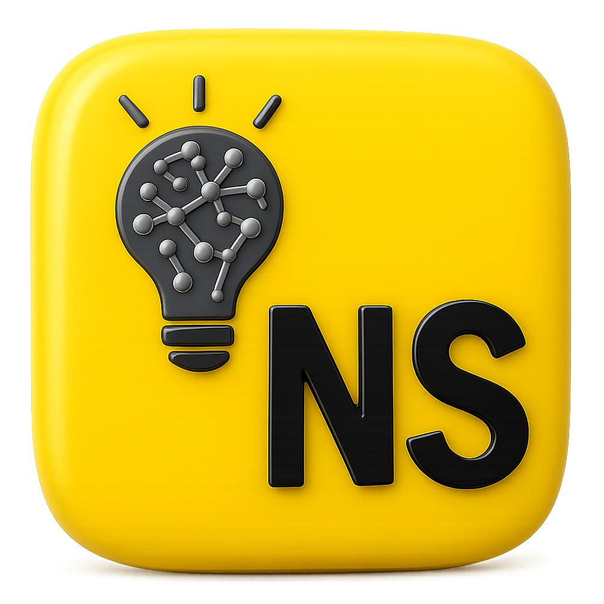

<div align="center">
  
  <h1 align="center">
    NullScript Intelligence
  </h1>

  <p align="center">
    Intelligent language support for NullScript in VS Code
  </p>

  <p align="center">
    <a href="https://marketplace.visualstudio.com/items?itemName=nullscript-lang.nullscript-intelligence">
      
    </a>
    <a href="https://github.com/nullscript-lang/nullscript/blob/main/LICENSE">
      
    </a>
  </p>

  <p align="center">
    <a href="https://nullscript.js.org">📚 Documentation</a>
    ·
    <a href="https://nullscript.js.org/examples/basic.html">💡 Examples</a>
    ·
    <a href="https://nullscript.js.org/reference/keywords.html">🔤 Keywords</a>
  </p>
</div>

> **The ultimate VS Code extension for NullScript development** - featuring intelligent auto-completion, contextual documentation, and beautiful syntax highlighting.

## ✨ Features

### 🚀 **Smart Auto-Completion**
- **Keyword suggestions** for all NullScript keywords and methods
- **Context-aware completions** for `speak.` and `clock.` methods
- **Import assistance** with module suggestions
- **Design pattern snippets** for common programming patterns

### 💡 **Rich Hover Documentation**
- **Comprehensive tooltips** with detailed explanations
- **JavaScript equivalents** showing how NullScript transpiles
- **Usage examples** and best practices
- **Performance hints** and category tips

### 🎨 **Beautiful Syntax Highlighting**
- **Full syntax support** for `.ns` files
- **Keyword highlighting** with distinct colors
- **String and comment support** with proper formatting
- **Bracket matching** and indentation guides

### 🔧 **Developer Experience**
- **Code snippets** for common patterns
- **Language configuration** with proper indentation
- **File association** for `.ns` files

## 🚀 Quick Start

### 1. Create Your First NullScript File

Create a new file with the `.ns` extension:

```javascript
// hello.ns
run greet(name) {
    speak.say(`Hello, ${name}!`);
    speak.log("Welcome to NullScript!");
}

greet("World");
```

### 2. Experience the Intelligence

- **Type `speak.`** - Get suggestions for console methods (`say`, `scream`, `yell`)
- **Type `clock.`** - Get suggestions for date methods (`now`, `parse`)
- **Hover over keywords** - See detailed documentation with examples
- **Use snippets** - Type `run`, `model`, `whatever`, etc. and press Tab


Learn more at [nullscript.js.org](https://nullscript.js.org/guide/vscode-extension.html)

---

**Happy coding with NullScript! 🎭✨**

*Made with ❤️ by the NullScript Language Team*
